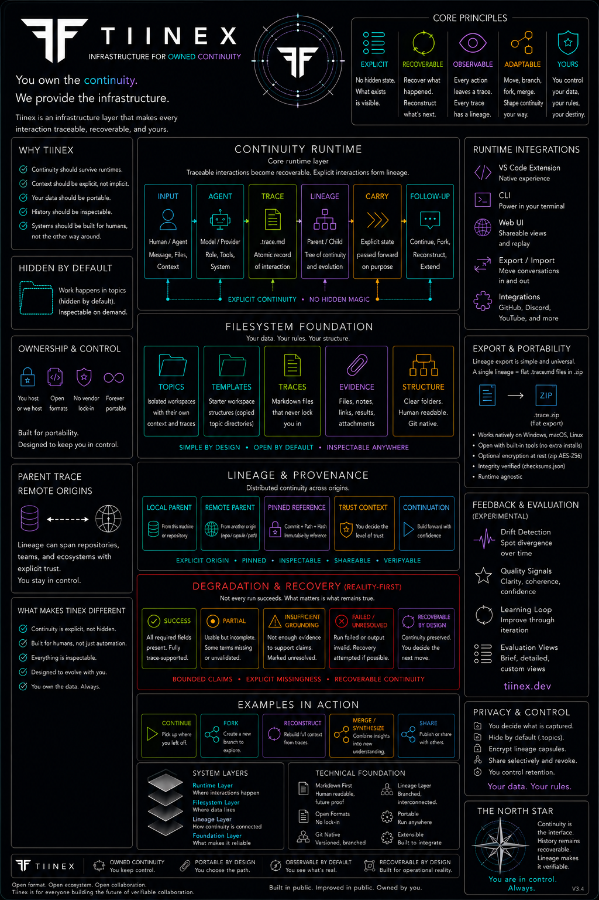

# Tiinex

Infrastructure for owned continuity.

---

---

## What Tiinex Is

Tiinex explores continuity infrastructure built around operational reality.

The goal is not AGI, replacement of humans, or hidden orchestration magic.

The goal is making AI-assisted workflows:

- explicit
- recoverable
- inspectable
- portable
- lineage-aware
- runtime-agnostic

Every interaction can become a trace.  
Every trace can participate in lineage.  
Continuity should survive runtimes, tools, providers, and platforms.

---

## Start Here

- **Core continuity and provenance work** → https://github.com/Tiinex/ai-provenance  
- **VS Code tooling and local inspection utilities** → https://github.com/Tiinex/ai-vscode-tools  
- **Experimental feedback and topic tooling** → https://github.com/Tiinex/feedback  
- **Public website** → https://github.com/Tiinex/site  

Choose the repository that matches the work surface instead of defaulting to `.github`.

---

## Core Principles

### Explicit
No hidden state required.

### Recoverable
Reconstruct what happened and continue forward.

### Observable
Inspect traces, lineage, continuity, and artifacts.

### Adaptable
Move across runtimes, providers, workflows, and environments.

### Yours
Your data. Your rules. Your continuity.

---

## Workflow Philosophy

Tiinex is built around the idea that continuity should be:

- inspectable instead of hidden
- recoverable instead of fragile
- portable instead of platform-locked
- explicit instead of magical

The system intentionally embraces imperfect operational reality:

- degraded states
- partial success
- unresolved outputs
- reconstruction
- continuation under uncertainty

---

## Filesystem-Native by Design

The ecosystem explores:

- markdown-first workflows
- `.trace.md` lineage artifacts
- portable `.trace.zip` exports
- integrity verification
- explicit provenance
- recoverable carry-forward state

The goal is not proprietary containers.

The goal is continuity that survives platforms.

---

## Runtime Direction

Tiinex currently explores workflows around:

- traces
- lineage
- continuity carry-forward
- provenance
- degradation & recovery
- export/import
- observability
- evaluation
- runtime interoperability

The ecosystem is intentionally modular and runtime-agnostic.

---

## Current State

Everything is still work in progress.

Documentation, semantics, workflows, and structure may evolve over time.

The project is being developed in public and intentionally favors:

- explicit iteration
- inspectability
- recoverability
- operational grounding

over polished illusion.

---

## Philosophy

Foundation first.

A stable continuity layer enables everything that comes next.

---

## Support

If you find the work valuable and want to support continued development:
https://ko-fi.com/Tiinusen
