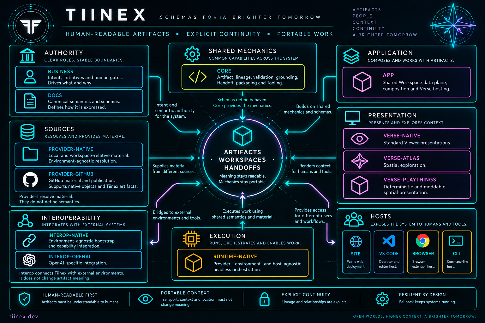

  

# Tiinex

Tiinex is an open-source format and toolkit for keeping **work, provenance, and continuity readable, portable, and recoverable**.

Important work often survives while the context around it disappears into chats, tools, private state, undocumented assumptions, or platform-specific history. Tiinex keeps that context close to the work in human-readable artifacts that can be inspected, continued, reviewed, and moved across tools without depending on one application or provider to explain what happened.

## Core principles

- **Human-readable first.** Important meaning should remain understandable without a specific runtime or UI.
- **Explicit continuity.** Parent, origin, transition, evidence, policy, and Handoff describe different relationships and are kept distinct.
- **Portable by design.** Artifacts and Workspaces can move across hosts and providers without becoming owned by them.
- **Location is not authority.** A repository, provider, UI, or publication target does not define an artifact's semantics merely because it stores or presents it.
- **Context is not mutation authority.** Material carried for grounding or review is not automatically writable or transferred work.

## What Tiinex can preserve

Tiinex artifacts can carry the context needed to understand and continue work, including:

- where material came from
- what it follows from
- what changed and why
- evidence and source boundaries
- dependencies and limitations
- decisions, tasks, and responsibilities
- Handoffs between people, tools, or roles
- what should not be inferred from the material

The shared semantic surface stays human-readable. Runtime projections, caches, transport representations, and UI state may be machine-oriented, but they do not replace artifact meaning.

## Architecture

Tiinex separates authority, mechanics, application state, sources, presentation, interoperability, hosts, and execution so each layer can evolve without becoming a second source of truth.

| Area | Responsibility | Repositories |
| --- | --- | --- |
| Project intent | Initiatives, priorities, roles, and human gates | [`business`](https://github.com/Tiinex/business) |
| Semantics | Canonical schemas, contracts, and interpretation rules | [`docs`](https://github.com/Tiinex/docs) |
| Shared mechanics | Artifacts, lineage, validation, grounding, Handoffs, packaging, and Tooling | [`core`](https://github.com/Tiinex/core) |
| Application | Shared Workspace data plane, composition, and Verse hosting | [`app`](https://github.com/Tiinex/app) |
| Providers | Source discovery, resolution, and publication | [`provider-native`](https://github.com/Tiinex/provider-native), [`provider-github`](https://github.com/Tiinex/provider-github) |
| Presentation | Viewer and spatial presentation families | [`verse-native`](https://github.com/Tiinex/verse-native), [`verse-atlas`](https://github.com/Tiinex/verse-atlas), [`verse-playthings`](https://github.com/Tiinex/verse-playthings) |
| Interoperability | External environments and capability integration | [`interop-native`](https://github.com/Tiinex/interop-native), [`interop-openai`](https://github.com/Tiinex/interop-openai) |
| Hosts | Web, editor, browser-extension, and command-line surfaces | [`site`](https://github.com/Tiinex/site), [`extension-vscode`](https://github.com/Tiinex/extension-vscode), [`extension-chrome`](https://github.com/Tiinex/extension-chrome), [`cli`](https://github.com/Tiinex/cli) |
| Execution | Provider-, environment-, and host-agnostic headless orchestration | [`runtime-native`](https://github.com/Tiinex/runtime-native) |

## Works with existing systems

Tiinex does not require every external system to store native Tiinex artifacts.

External material can be presented as a synthetic Tiinex projection when no artifact exists. When an external object carries a real Tiinex payload, Tiinex can recover and qualify that artifact instead of inventing a competing semantic representation.

This lets systems such as GitHub Issues and pull requests remain useful in their native form while participating in the same broader provenance and continuity model.

## Start here

- **Schemas and semantics:** [`Tiinex/docs`](https://github.com/Tiinex/docs)
- **Shared mechanics and Tooling:** [`Tiinex/core`](https://github.com/Tiinex/core)
- **Application layer:** [`Tiinex/app`](https://github.com/Tiinex/app)
- **Official web host:** [`Tiinex/site`](https://github.com/Tiinex/site)
- **Project intent and organization:** [`Tiinex/business`](https://github.com/Tiinex/business)

**Website:** https://tiinex.dev

> Meaning belongs in readable Tiinex artifacts and contracts. Shared implementation provides the mechanics. Hosts and providers expose capabilities without becoming semantic authority.
